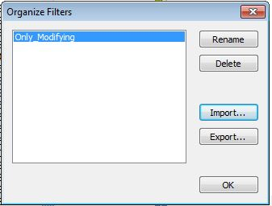
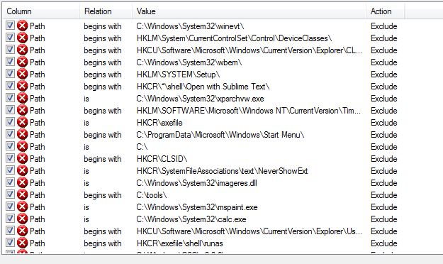
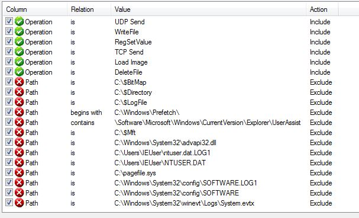

# procmon-filters

SysInternals' Process Monitor filters repository - collected from various places and made up by myself. To be used for quick Behavioral analysis of testing specimens.

## What is this?

This is a repository consisting of process monitor filters sets, that when used during analysis tasks can significantly aid events list reading. Procmon when instrumented with proper set of filters and highlights can greatly improve application analysis assignments. Since I was unable to find some valuable procmon filter already in the internet, I decided to come up with some made up by myself.
Please feel free to use, and contribute.

## How to use them?

Firstly, launch Procmon, then from *Filter* menu select *Organize filters...* as shown in the picture below:

Then, go for importing the file:

Finally, having them loaded, you'll have to select them in order to get them loaded by selecting from *Filter* menu the *Load Filter* item.

## What do they contain?

This section presents only brief description / list of the filters contained in repository. There are files like:

* `Agressive_Noise_Reduction.PMF` - containing a lot of entries with load of noisy entries being exclued:

* `Only_Modifying.PMF` - with only few entries specifying implicitely to include only modifying (writing file, deleting file, altering registry keys) events in the events list:

*Enjoy.*